# Documentation

First, we start the `Registration` server that runs Eureka, which waits for services to register:

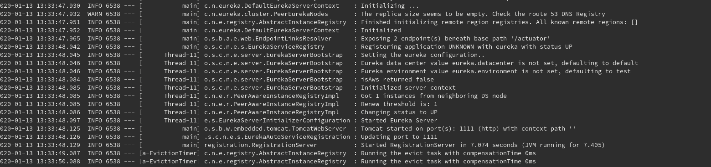

Then we start the `Accounts` server, that notifies `Registration` about being in `localhost:2222`:

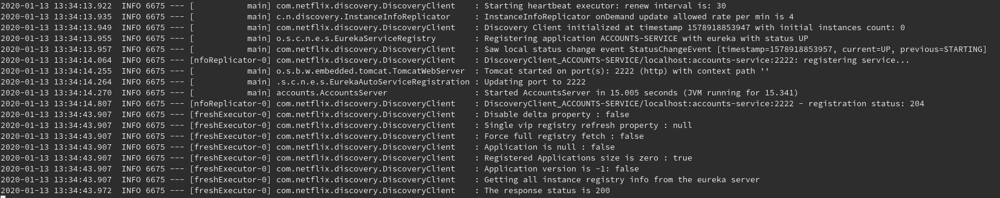

Then we start the `Web` server, that notifies `Registration` about being in `localhost:3333`

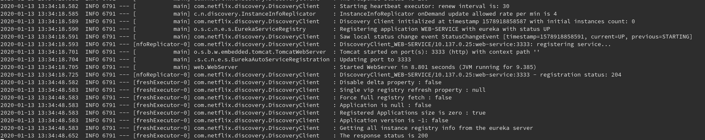

We can see at the log of `Registration` how both `Accounts` and `Web` have been registered:

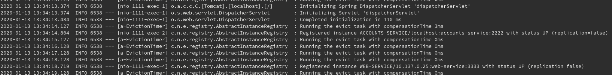

And they are also visible at the dashboard of Eureka:

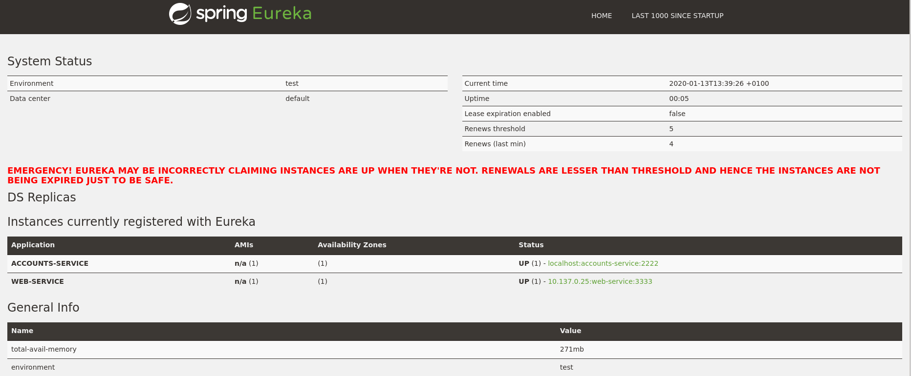

Then we start another `Accounts` server, that notifies `Registration` about being in `localhost:4444`

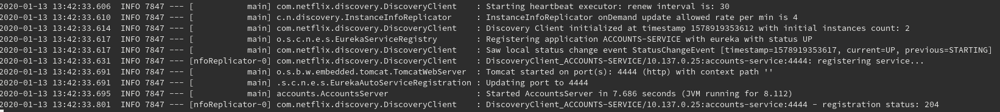

Which is reflected i the log of `Registration`:

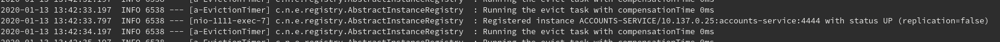

And at the dashboard:

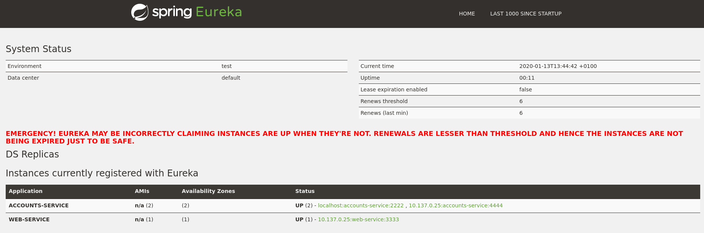

When searching an account through the `Web` interface, it uses the `Accounts` server at 4444:

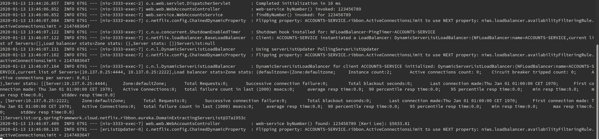

Here is the log of the 4444 `Accounts` server:

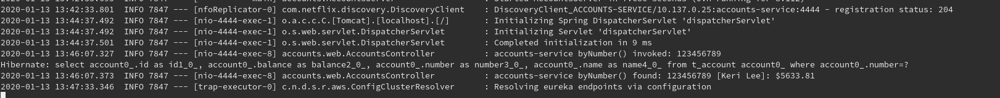

Then we kill the `Accounts` server at 4444, which is detected by `registration` and displayed at the dashboard:

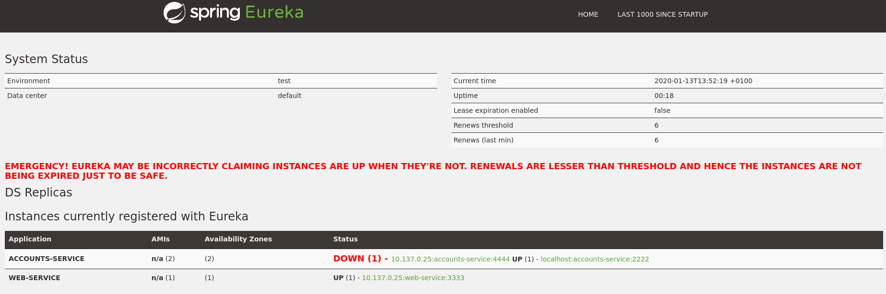

Now, when searching again at `Web`, it uses the `Accounts` server at 2222 instead, thanks to Eureka providing it 
with a list of available servers:

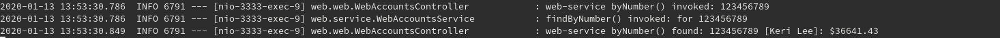

As we can see in the logs of `Accounts`:

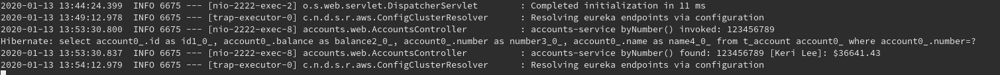
